<h3>Overview</h3>

Amazon SageMaker Pipelines , a new capability of Amazon SageMaker  that makes it easy for data scientists and engineers to build, automate, and scale end to end machine learning pipelines. SageMaker Pipelines is a native workflow orchestration tool  for building ML pipelines that take advantage of direct Amazon SageMaker  integration. Three components improve the operational resilience and reproducibility of your ML workflows: pipelines, model registry, and projects. These workflow automation components enable you to easily scale your ability to build, train, test, and deploy hundreds of models in production, iterate faster, reduce errors due to manual orchestration, and build repeatable mechanisms.

SageMaker projects introduce MLOps templates that automatically provision the underlying resources needed to enable CI/CD capabilities for your ML development lifecycle. You can use a number of built-in templates  or create your own custom template (https://docs.aws.amazon.com/sagemaker/latest/dgsagemaker-projects-templates-custom.html ). You can use SageMaker Pipelines independently to create automated workflows; however, when used in combination with SageMaker projects, the additional CI/CD capabilities are provided automatically. The following screenshot shows how the three components of SageMaker Pipelines can work together in an example SageMaker project.


This lab focuses on using an MLOps template to bootstrap your ML project and establish a CI/CD pattern from sample code. We show how to use the built-in build, train, and deploy project template as a base for a customer churn classification example. This base template enables CI/CD for training ML models, registering model artifacts to the model registry, and automating model deployment with manual approval and automated testing.

<h3>MLOps Template for building, training and deploying models</h3>

We start by taking a detailed look at what AWS services are launched when this build, train, and deploy MLOps template is launched. Later, we discuss how to modify the skeleton for a custom use case.

In SageMaker Studio, you can now choose the Projects menu on the Components and registries menu.


Once you choose Projects, click on <b>Create project</b> as below:

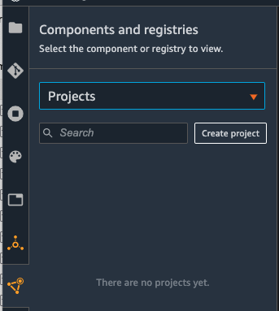

On the projects page, you can launch a preconfigured SageMaker MLOps template. For this lab, we choose <b>MLOps template for model building, training, and deployment</b> and click on <b>Select project template</b>

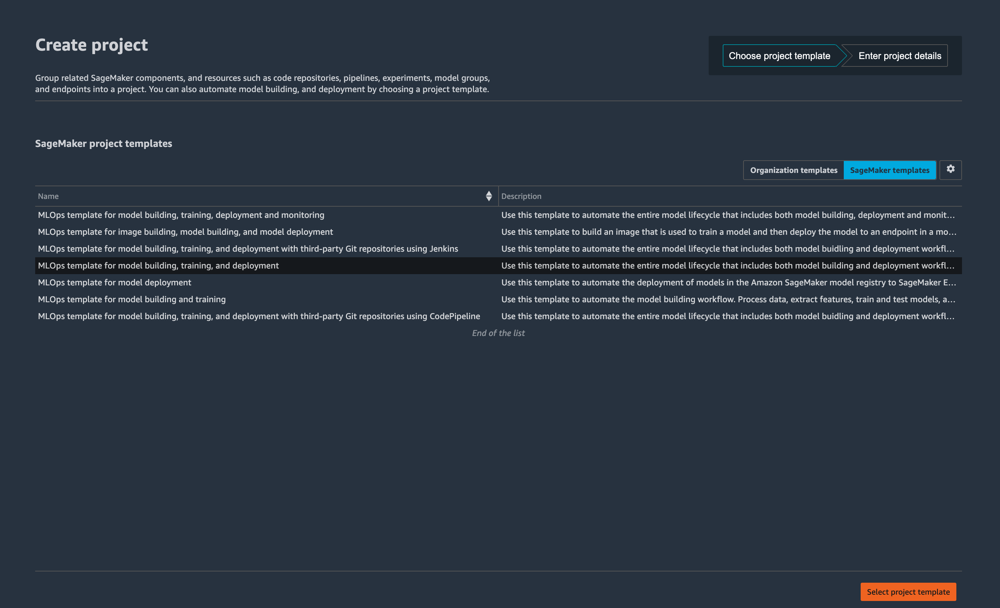

In the next page provide Project Name and short Description and select <b>Create Project.</b>. Please use the name as shown below

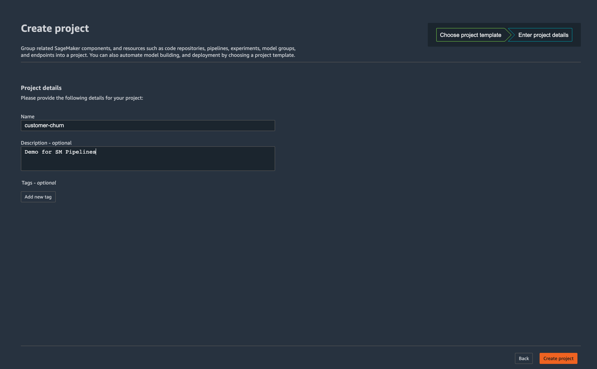

The project will take a while to be created.

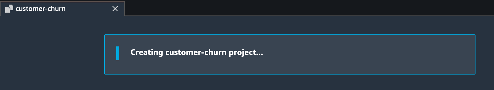

Launching this template starts a model building pipeline by default, and while there is no cost for using SageMaker Pipelines itself, you will be charged for the services launched. Cost varies by Region. A single run of the model build pipeline in us-east-1 is estimated to cost less than $0.50. Models approved for deployment incur the cost of the SageMaker endpoints (test and production) for the Region using an ml.m5.large instance.

After the project is created from the MLOps template, the following architecture is deployed.

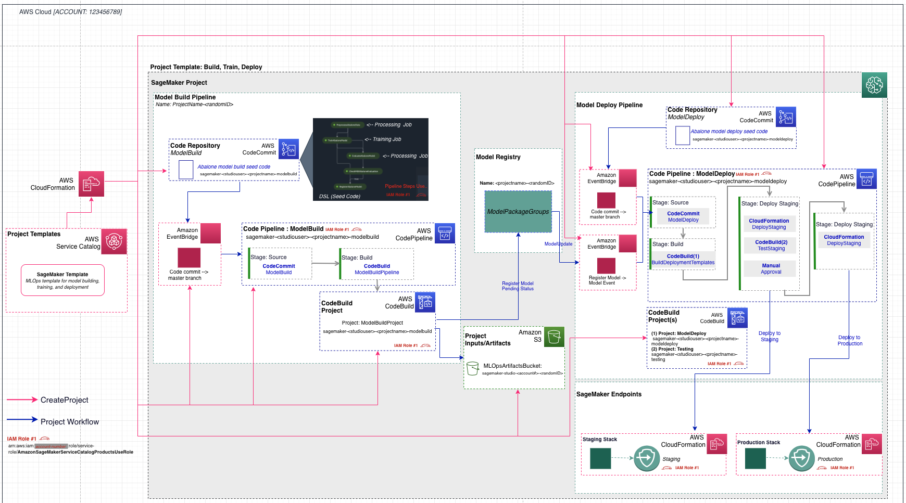

Included in the architecture are the following AWS services and resources:

<ul>
<li>The MLOps templates that are made available through SageMaker projects are provided via an AWS Service Catalog  portfolio that automatically gets imported when a user enables projects on the Studio domain.</li>

  <li>Two repositories are added to AWS CodeCommit : </li>

<ul>
<li> The first repository provides scaffolding code to create a multi-step model building pipeline including the following steps: data processing, model training, model evaluation, and conditional model registration based on accuracy. As you can see in the pipeline.py file, this pipeline trains a linear regression model using the XGBoost algorithm on the well-known UCI Abalone dataset . This repository also includes a build specification file , used by AWS CodePipeline  and AWS CodeBuild  to run the pipeline automatically. </li>


<li>The second repository contains code and configuration files for model deployment, as well as test scripts required to pass the quality gate. This repo also uses CodePipeline and CodeBuild, which run an AWS CloudFormation  template to create model endpoints for staging and production. </li>
</ul>

<li>Two CodePipeline pipelines: <li>

<ul>
<li>The ModelBuild pipeline automatically triggers and runs the pipeline from end to end whenever a new commit is made to the ModelBuild CodeCommit repository.</li>

<li>The ModelDeploy pipeline automatically triggers whenever a new model version is added to the model registry and the status is marked as Approved. Models that are registered with Pending or Rejected statuses aren’t deployed.</li>

</ul>
  
<li>An Amazon Simple Storage Service  (Amazon S3) bucket is created for output model artifacts generated from the pipeline. </li>

<li>SageMaker Pipelines uses the following resources: </li>

<ul>
<li>This workflow contains the directed acyclic graph (DAG) that trains and evaluates our model. Each step in the pipeline keeps track of the lineage and intermediate steps can be cached for quickly re-running the pipeline. Outside of templates, you can also create pipelines using the SDK . </li>

<li>Within SageMaker Pipelines, the SageMaker model registry  tracks the model versions and respective artifacts, including the lineage and metadata for how they were created. Different model versions are grouped together under a model group, and new models registered to the registry are automatically versioned. The model registry also provides an approval workflow for model versions and supports deployment of models in different accounts. You can also use the model registry through the boto3 package </li>
</ul>
  
<li>Two SageMaker endpoints: </li>

<ul>
<li>After a model is approved in the registry, the artifact is automatically deployed to a staging endpoint followed by a manual approval step.</li>

<li>If approved, it’s deployed to a production endpoint in the same AWS account. </li>
</ul>
  
</ul>
All SageMaker resources, such as training jobs, pipelines, models, and endpoints, as well as AWS resources listed in this lab, are automatically tagged with the project name and a unique project ID tag.

<h3>Modifying the Seed Code for Custom Use Case</h3>

After your project has been created, the architecture described earlier is deployed and the visualization of the pipeline is available on the Pipelines drop-down menu within SageMaker Studio.

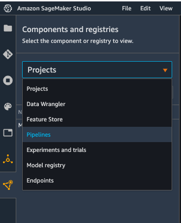

To modify the sample code from this launched template, <b>we first need to clone the CodeCommit repositories to our local SageMaker Studio instance</b>. From the list of projects, choose the one that was just created. On the <b>Repositories</b> tab, you can select the hyperlinks to locally clone the CodeCommit repos.

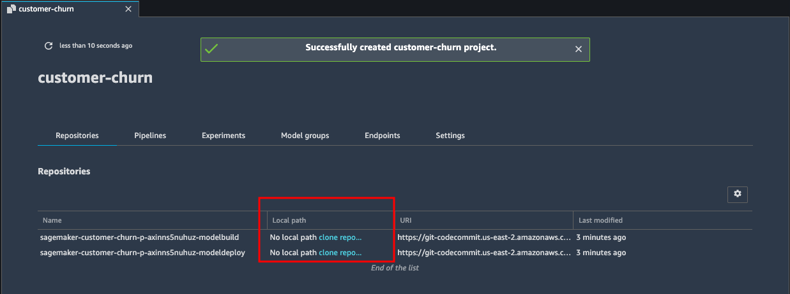

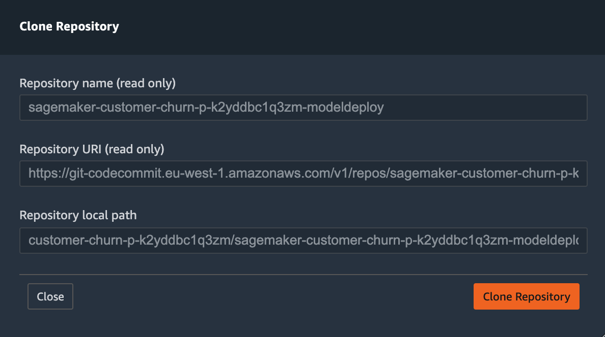

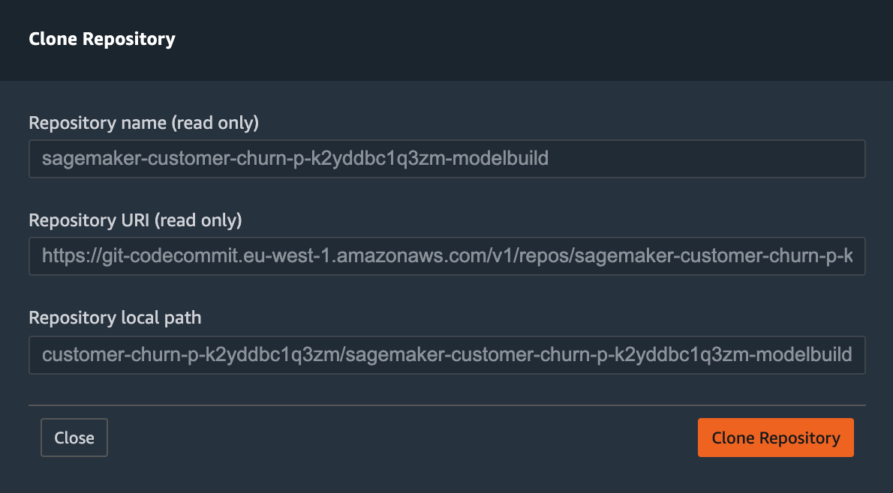

Once both repositories have been cloned you should see the following:

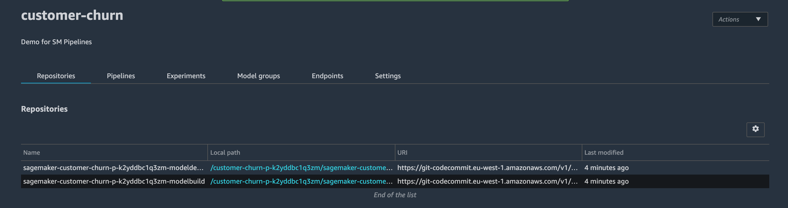

<h3>ModelBuild Repo:</h3>

The ModelBuild repository contains the code for preprocessing, training, and evaluating the model. The sample code trains and evaluates a model on the UCI Abalone dataset . We can modify these files to solve our own customer churn use case. See the following code:

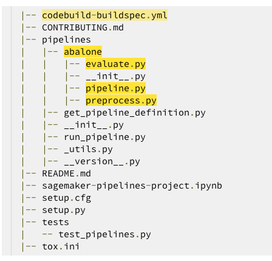

We now need a dataset accessible to the project.

1. Open a new SageMaker notebook, choose python3 (Data Science) as the kernel.

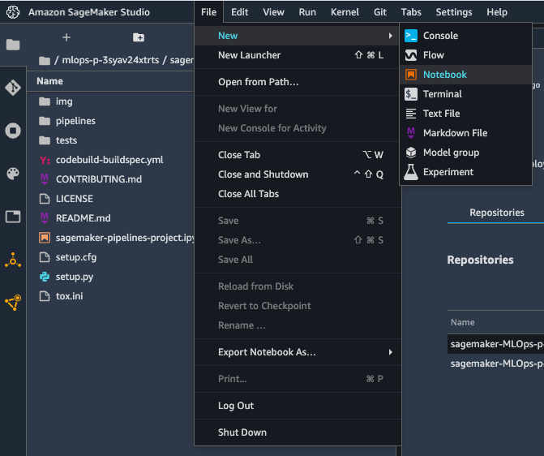

If you are prompted for a kernel, choose Data Science and Python 3.

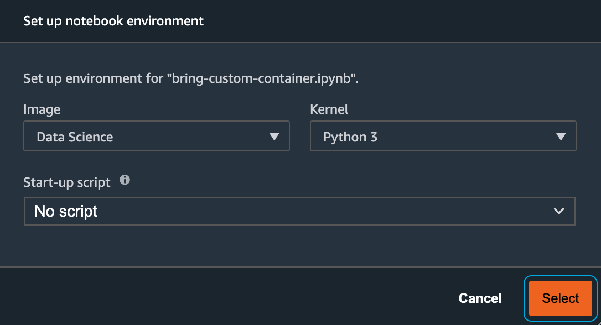

2. Inside Studio Notebook, once the kernel is started, run the following code in a cell block to download a data text file and save it as a .csv in your bucket:

```
!aws s3 cp s3://sagemaker-sample-files/datasets/tabular/synthetic/churn.txt ./
import boto3
import os
import sagemaker
prefix = 'sagemaker/DEMO-xgboost-churn'
region = boto3.Session().region_name
default_bucket = sagemaker.session.Session().default_bucket()
RawData = boto3.Session().resource('s3')\
.Bucket(default_bucket).Object(os.path.join(prefix, 'data/RawData.csv'))\
.upload_file('./churn.txt')
print(os.path.join("s3://",default_bucket, prefix, 'data/RawData.csv'))
```

3. Navigate to the pipelines directory inside the modelbuild directory and rename the abalone directory to customer_churn (as shown below).

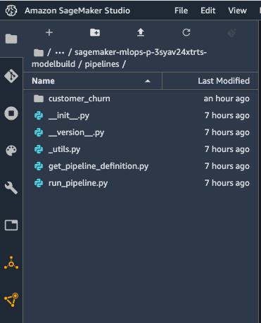

4. Now open the codebuild-buildspec.yml file in the modelbuild directory and modify the run pipeline path from run-pipeline --module-name pipelines.abalone.pipeline to this:

```
run-pipeline --module-name pipelines.customer_churn.pipeline \
```
This is also shown in the image below - line 15. This code can be found <a href="codebuild-buildspec.yml">here</a> .

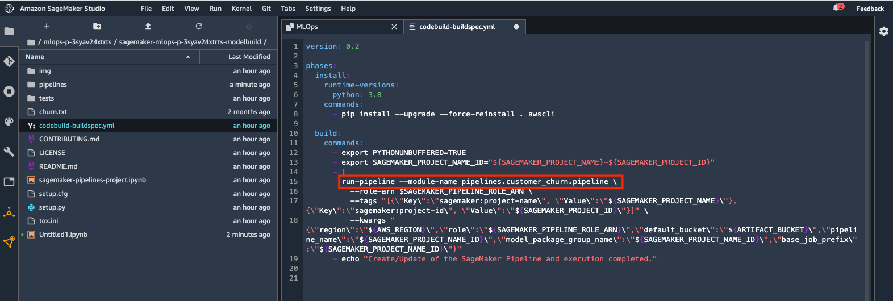

Save the file.

5. Now you need to replace all 3 files inside the Pipeline directory as shown below;


6. Replace the <b>preprocess.py</b> code under the <b>ustomer_churn</b> folder with the customer churn <a href="precprocess.py">preprocessing script found in the sample repository.</a>


