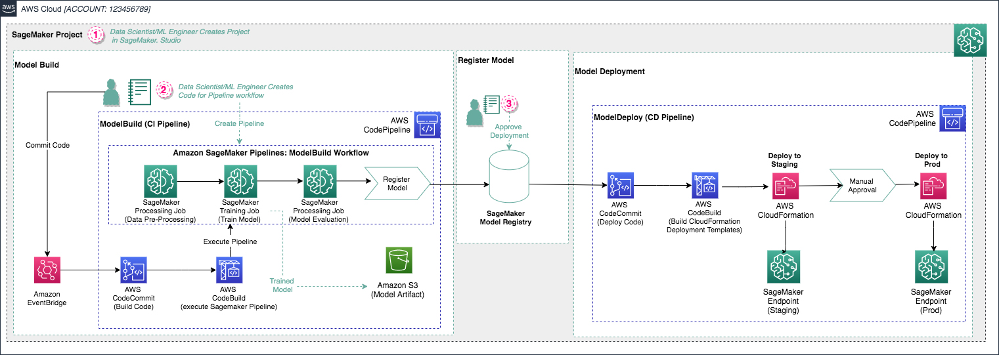

<h3>Overview</h3>

Amazon SageMaker Pipelines , a new capability of Amazon SageMaker  that makes it easy for data scientists and engineers to build, automate, and scale end to end machine learning pipelines. SageMaker Pipelines is a native workflow orchestration tool  for building ML pipelines that take advantage of direct Amazon SageMaker  integration. Three components improve the operational resilience and reproducibility of your ML workflows: pipelines, model registry, and projects. These workflow automation components enable you to easily scale your ability to build, train, test, and deploy hundreds of models in production, iterate faster, reduce errors due to manual orchestration, and build repeatable mechanisms.

SageMaker projects introduce MLOps templates that automatically provision the underlying resources needed to enable CI/CD capabilities for your ML development lifecycle. You can use a number of built-in templates  or create your own custom template (https://docs.aws.amazon.com/sagemaker/latest/dgsagemaker-projects-templates-custom.html ). You can use SageMaker Pipelines independently to create automated workflows; however, when used in combination with SageMaker projects, the additional CI/CD capabilities are provided automatically. The following screenshot shows how the three components of SageMaker Pipelines can work together in an example SageMaker project.

This lab focuses on using an MLOps template to bootstrap your ML project and establish a CI/CD pattern from sample code. We show how to use the built-in build, train, and deploy project template as a base for a customer churn classification example. This base template enables CI/CD for training ML models, registering model artifacts to the model registry, and automating model deployment with manual approval and automated testing.

<h3>MLOps Template for building, training and deploying modelsHeader anchor link</h3>

We start by taking a detailed look at what AWS services are launched when this build, train, and deploy MLOps template is launched. Later, we discuss how to modify the skeleton for a custom use case.

In SageMaker Studio, you can now choose the Projects menu on the Components and registries menu.

