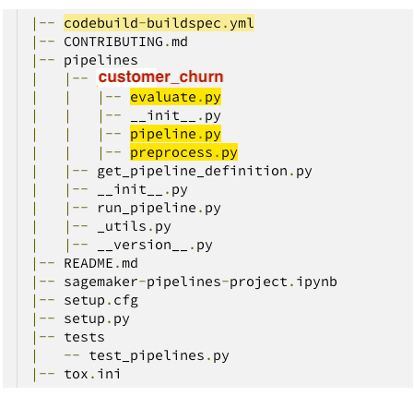
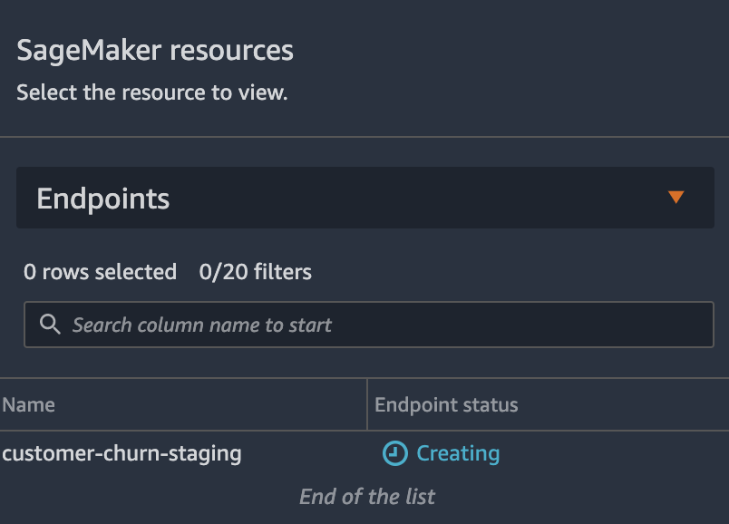

<h2>Getting Started with the Workshop </h2>

You will need to create a Cloud9 instance to simulate the ML Practitioner's development experience. Complete the following steps to begin.

The content for this workshop has been tested in the us-east-1 (N-Virginia) region.

<b>Step 1</b>

Log into the AWS account with your provided user credentials.

<b>Step 2</b>

Click Services, and under the Developer Tools section, click Cloud9. This will open the Cloud9 dashboard. Click Create environment in the top-right corner.


<b>Step 3</b>

For the Name, enter WorkshopIDE and optionally provide a Description. Click Next step.

<b>Step 4</b>

You may leave the Environment settings at their defaults, but launch a new t3.large EC2 instance by clicking Other instance type check-box, and selecting t3.large from the drop-down list.

<b>Step 5</b>

Leave the Platform, IAM Role, and the other settings at their defaults. Click Next Step.

<b>Step 6</b>

Review the environment settings and click Create environment.

It will take a few minutes for your environment to be provisioned and prepared.

Once ready, your IDE will open to a welcome screen.

The central panel of the IDE has two parts, a text/code editor in the upper half, and a terminal window in the lower half. Below the welcome screen in the editor, you should see a terminal prompt and may need to scroll down below the welcome screen to access it. You will be using the terminal window significantly during the workshop.

<b>Step 7</b>

Next you will ensure the environment permissions are configured correctly. Using the terminal, run the following AWS CLI command to see the IAM Role you are currently using:

```
aws sts get-caller-identity
```

The command output should look similar to the following:

```
{
    "Account": "1234567891112",
    "UserId": "AROAAAAAAAAAEXAMPLE:MasterKey",
    "Arn": "arn:aws:sts::1234567891112:assumed-role/TeamRole/MasterKey"
}
```

<b>Step 8</b>

Since you will be executing long-running Python API calls to various AWS Services in later parts of the workshop, you will need to ensure that the security token within the request does not expire. To this end, you will create an ML-Practitioner IAM Role and assign it to the Cloud9 environment.

Click the grey circle button in the top-right corner and select Manage EC2 Instance.


This will launch the EC2 Management Console in a new browser tab.

<b>Step 9</b>

Within the EC2 Console, click the check-box next to the aws-cloud9-WorkshopIDE-... instance. Click Action, Security, and then Modify IAM role.


<b>Step 10</b>

To create the ML-Practitioner Role, click on Create new IAM role.


This will launch the IAM Management Console in a new browser tab. In the IAM Management Console tab, click the Create role button to start the process of creating the new role.

<b>Step 11 </b>

In the Create role wizard, select EC2, and then click the Next: Permissions


<b>Step 12</b>

In the Attach permissions policies section, click the check-box next to AdministratorAccess and click Next: Tags.


<b>Step 13</b>

Click on the Next:Review button to proceed to the next step of the wizard.


<b>Step 13</b>

Click on the Next:Review button to proceed to the next step of the wizard.


<b>Step 14</b>

Enter ML-Practitioner in the Role name text-box and click Create role.


Once the role has been created, close the IAM Management Console browser tab and go back to the browser tab displaying the Modify IAM role interface.

<b>Step 15</b>

To modify the role, click the "refresh" button, and then from the drop-down, select the newly created ML-Practioner role. Click Save to assign the role to the Cloud9 Instance.

If you see the Failed to attach instance profile message, wait 10 seconds for the IAM Role to fully propagate before trying again.

<b>Step 16</b>

Go back to the browser tab for your Cloud9 IDE and click AWS Cloud9 in the top-left corner. Select Preferences.


This will open the Cloud9 Preferences tab. Scroll down and click the AWS SETTINGS section. Click the radio-button to disable AWS managed temporary credentials:.


<h2> MLOps - Immersion Day </h2>


<ul>
<li><a href = "#overview">Overview</a></li>
<li><a href= "#MLOps-Template-for-building-training-and-deploying-models">MLOps Template for building, training and deploying models</a></li>
<li><a href="#Modifying-the-Seed-Code-for-Custom-Use-Case">Modifying the Seed Code for Custom Use Case</a></li>
<li><a href="#Model-Build-Repo">Model Build Repo</a></li>
<li><a href="#Model-Deploy-repo">Model Deploy repo</a></li>
<li><a href="#Triggering-a-pipeline-run">Triggering a pipeline run</a></li>
<li><a href="#Conclusion">Conclusion</a></li>
</ul>


<a href="#overview"><h3>Overview</h3></a>

Amazon SageMaker Pipelines , a new capability of Amazon SageMaker  that makes it easy for data scientists and engineers to build, automate, and scale end to end machine learning pipelines. SageMaker Pipelines is a native workflow orchestration tool  for building ML pipelines that take advantage of direct Amazon SageMaker  integration. Three components improve the operational resilience and reproducibility of your ML workflows: pipelines, model registry, and projects. These workflow automation components enable you to easily scale your ability to build, train, test, and deploy hundreds of models in production, iterate faster, reduce errors due to manual orchestration, and build repeatable mechanisms.

SageMaker projects introduce MLOps templates that automatically provision the underlying resources needed to enable CI/CD capabilities for your ML development lifecycle. You can use a number of built-in templates  or create your own custom template (https://docs.aws.amazon.com/sagemaker/latest/dgsagemaker-projects-templates-custom.html ). You can use SageMaker Pipelines independently to create automated workflows; however, when used in combination with SageMaker projects, the additional CI/CD capabilities are provided automatically. The following screenshot shows how the three components of SageMaker Pipelines can work together in an example SageMaker project.


This lab focuses on using an MLOps template to bootstrap your ML project and establish a CI/CD pattern from sample code. We show how to use the built-in build, train, and deploy project template as a base for a customer churn classification example. This base template enables CI/CD for training ML models, registering model artifacts to the model registry, and automating model deployment with manual approval and automated testing.

<h3>MLOps Template for building, training and deploying models</h3>

We start by taking a detailed look at what AWS services are launched when this build, train, and deploy MLOps template is launched. Later, we discuss how to modify the skeleton for a custom use case.

In SageMaker Studio, you can now choose the Projects menu on the Components and registries menu.


Once you choose Projects, click on <b>Create project</b> as below:


On the projects page, you can launch a preconfigured SageMaker MLOps template. For this lab, we choose <b>MLOps template for model building, training, and deployment</b> and click on <b>Select project template</b>


In the next page provide Project Name and short Description and select <b>Create Project.</b>. Please use the name as shown below


The project will take a while to be created.


Launching this template starts a model building pipeline by default, and while there is no cost for using SageMaker Pipelines itself, you will be charged for the services launched. Cost varies by Region. A single run of the model build pipeline in us-east-1 is estimated to cost less than $0.50. Models approved for deployment incur the cost of the SageMaker endpoints (test and production) for the Region using an ml.m5.large instance.

After the project is created from the MLOps template, the following architecture is deployed.


Included in the architecture are the following AWS services and resources:

<ul>
<li>The MLOps templates that are made available through SageMaker projects are provided via an AWS Service Catalog  portfolio that automatically gets imported when a user enables projects on the Studio domain.</li>

  <li>Two repositories are added to AWS CodeCommit : </li>

<ul>
<li> The first repository provides scaffolding code to create a multi-step model building pipeline including the following steps: data processing, model training, model evaluation, and conditional model registration based on accuracy. As you can see in the pipeline.py file, this pipeline trains a linear regression model using the XGBoost algorithm on the well-known UCI Abalone dataset . This repository also includes a build specification file , used by AWS CodePipeline  and AWS CodeBuild  to run the pipeline automatically. </li>


<li>The second repository contains code and configuration files for model deployment, as well as test scripts required to pass the quality gate. This repo also uses CodePipeline and CodeBuild, which run an AWS CloudFormation  template to create model endpoints for staging and production. </li>
</ul>

<li>Two CodePipeline pipelines: <li>

<ul>
<li>The ModelBuild pipeline automatically triggers and runs the pipeline from end to end whenever a new commit is made to the ModelBuild CodeCommit repository.</li>

<li>The ModelDeploy pipeline automatically triggers whenever a new model version is added to the model registry and the status is marked as Approved. Models that are registered with Pending or Rejected statuses aren’t deployed.</li>

</ul>
  
<li>An Amazon Simple Storage Service  (Amazon S3) bucket is created for output model artifacts generated from the pipeline. </li>

<li>SageMaker Pipelines uses the following resources: </li>

<ul>
<li>This workflow contains the directed acyclic graph (DAG) that trains and evaluates our model. Each step in the pipeline keeps track of the lineage and intermediate steps can be cached for quickly re-running the pipeline. Outside of templates, you can also create pipelines using the SDK . </li>

<li>Within SageMaker Pipelines, the SageMaker model registry  tracks the model versions and respective artifacts, including the lineage and metadata for how they were created. Different model versions are grouped together under a model group, and new models registered to the registry are automatically versioned. The model registry also provides an approval workflow for model versions and supports deployment of models in different accounts. You can also use the model registry through the boto3 package </li>
</ul>
  
<li>Two SageMaker endpoints: </li>

<ul>
<li>After a model is approved in the registry, the artifact is automatically deployed to a staging endpoint followed by a manual approval step.</li>

<li>If approved, it’s deployed to a production endpoint in the same AWS account. </li>
</ul>
  
</ul>
All SageMaker resources, such as training jobs, pipelines, models, and endpoints, as well as AWS resources listed in this lab, are automatically tagged with the project name and a unique project ID tag.

<h3>Modifying the Seed Code for Custom Use Case</h3>

After your project has been created, the architecture described earlier is deployed and the visualization of the pipeline is available on the Pipelines drop-down menu within SageMaker Studio.


To modify the sample code from this launched template, <b>we first need to clone the CodeCommit repositories to our local SageMaker Studio instance</b>. From the list of projects, choose the one that was just created. On the <b>Repositories</b> tab, you can select the hyperlinks to locally clone the CodeCommit repos.


Once both repositories have been cloned you should see the following:


<h3>Model Build Repo:</h3>

The ModelBuild repository contains the code for preprocessing, training, and evaluating the model. The sample code trains and evaluates a model on the UCI Abalone dataset . We can modify these files to solve our own customer churn use case. See the following code:


We now need a dataset accessible to the project.

1. Open a new SageMaker notebook, choose python3 (Data Science) as the kernel.


If you are prompted for a kernel, choose Data Science and Python 3.


2. Inside Studio Notebook, once the kernel is started, run the following code in a cell block to download a data text file and save it as a .csv in your bucket:

```
!aws s3 cp s3://sagemaker-sample-files/datasets/tabular/synthetic/churn.txt ./
import boto3
import os
import sagemaker
prefix = 'sagemaker/DEMO-xgboost-churn'
region = boto3.Session().region_name
default_bucket = sagemaker.session.Session().default_bucket()
RawData = boto3.Session().resource('s3')\
.Bucket(default_bucket).Object(os.path.join(prefix, 'data/RawData.csv'))\
.upload_file('./churn.txt')
print(os.path.join("s3://",default_bucket, prefix, 'data/RawData.csv'))
```

3. Navigate to the pipelines directory inside the modelbuild directory and rename the abalone directory to customer_churn (as shown below).


4. Now open the codebuild-buildspec.yml file in the modelbuild directory and modify the run pipeline path from run-pipeline --module-name pipelines.abalone.pipeline to this:

```
run-pipeline --module-name pipelines.customer_churn.pipeline \
```
This is also shown in the image below - line 15. This code can be found <a href="codebuild-buildspec.yml">here</a> .


Save the file.

5. Now you need to replace all 3 files inside the Pipeline directory as shown below;



6. Replace the <b>preprocess.py</b> code under the <b>ustomer_churn</b> folder with the customer churn <a href="preprocess.py">preprocessing script found in the sample repository.</a>


7. Replace the <b>pipeline.py</b> code under the customer_churn folder with the customer churn <a href="preprocess.py">pipeline script found in the sample repository </a> . Be sure to replace the “InputDataUrl” (line 121 of pipeline.py) default parameter with the Amazon S3 URL obtained in Step 2:

```
input_data = ParameterString(
    name="InputDataUrl",
    default_value=f"s3://YOUR-BUCKET/sagemaker/DEMO-xgboost-churn/data/RawData.csv",
)
```


The conditional step to evaluate the classification model should already be as the following:

```
# Conditional step for evaluating model quality and branching execution</p>
cond_lte = ConditionGreaterThanOrEqualTo(
    left=JsonGet(step=step_eval, property_file=evaluation_report, json_path="binary_classification_metrics.accuracy.value"), right=0.8
)
```


8. Replace the evaluate.py code with the customer churn evaluation script found in the sample repository . One piece of the code we’d like to point out is that, because we’re evaluating a classification model, we need to update the metrics we’re evaluating and associating with trained models:

```
report_dict = {
    "binary_classification_metrics": {
        "accuracy": {
            "value": acc,
            "standard_deviation" : "NaN"
        },
        "auc" : {
            "value" : auc,
            "standard_deviation": "NaN"
        },
    },
}
evaluation_output_path = '/opt/ml/processing/evaluation/evaluation.json'
with open(evaluation_output_path, 'w') as f:
    f.write(json.dumps(report_dict))
```
The JSON structure of these metrics are required to match the format of sagemaker.model_metrics for complete integration with the model registry. 

<h3>ModelDeploy repo:</h3>

The ModelDeploy repository contains the AWS CloudFormation buildspec for the deployment pipeline. We don’t make any modifications to this code because it’s sufficient for our customer churn use case. It’s worth noting that model tests can be added to this repo to gate model deployment. See the following code:

```
├── build.py
├── buildspec.yml
├── endpoint-config-template.yml
├── prod-config.json
├── README.md
├── staging-config.json
└── test
├── buildspec.yml
└── test.py
```

<h3>Triggering a pipeline run</h3>

Committing these changes to the CodeCommit repository (easily done on the Studio source control tab) triggers a new pipeline run, because an <a href="https://aws.amazon.com/eventbridge/">Amazon EventBridge</a>  event monitors for commits. After a few moments, we can monitor the run by choosing the pipeline inside the SageMaker project.

<ul>
1. To commit the changes, navigate to the Git Section on the left panel and follow the steps in the screenshot below
<ul>  
  <li>Stage all changes</li>
  <li>Commit the changes by providing a Summary and your Name and an email address</li>
  <li>Push the changes.</li>
  </ul>


Make sure you stage the Untracked changes as well.

  


2. Navigate back to the project and select the Pipelines section.
  

  
Under execution the following screenshot shows our pipeline details.
  

  
3. If you double click on the executing pipelines, the steps of the pipeline will appear. You will be able to monitor the step that is currently running.
  

  

  
4. When the pipeline is complete, you can go back to the project screen and choose the Model groups tab. You can then inspect the metadata attached to the model artifacts.
  

  
5. If everything looks good, you can click on the Update Status tab and manually approve the model.
 

  

  

  
 You can then go to Endpoints in the SageMaker menu.


  
You will see a staging endpoint being created.
  

  
After a while the endpoint will be listed with the InService status.
  

  
To deploy the endpoint into production, you need to put your "DevOps Team" hat and go to CodePipeline.
  


Click on the modeldeploy pipeline which is currently in progress.
  

  
At the end of the DeployStaging phase, you need to manually approve the deployment.
  

  

  
Once it is done you will see the production endpoint being deployed in the SageMaker Endpoints.
  

  
After a while the endpoint will also be InService.
  

  
  <h3>Conclusion</h3>
  
In this lab we have walked through how a data scientist can modify a preconfigured MLOps template for their own modeling use case. Among the many benefits is that the changes to the source code can be tracked, associated metadata can be tied to trained models for deployment approval, and repeated pipeline steps can be cached for reuse. To learn more about SageMaker Pipelines, check out the <a href="https://aws.amazon.com/sagemaker/pipelines/">website</a>  and the <a href="https://docs.aws.amazon.com/sagemaker/latest/dg/pipelines.html">documentation.</a>

  
