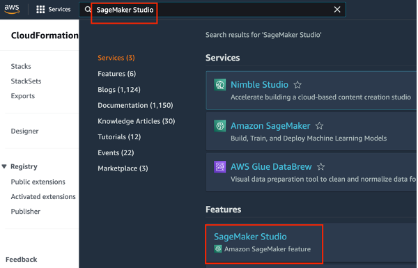
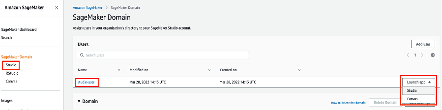
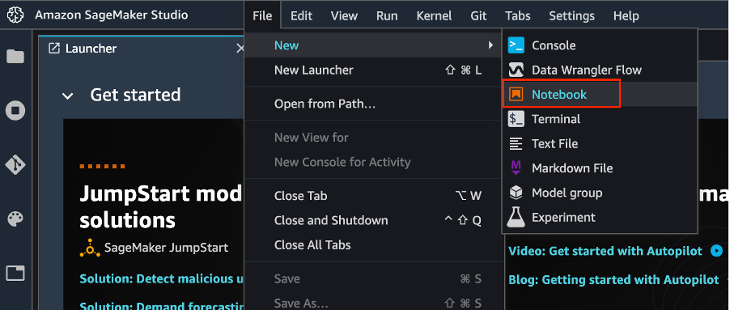
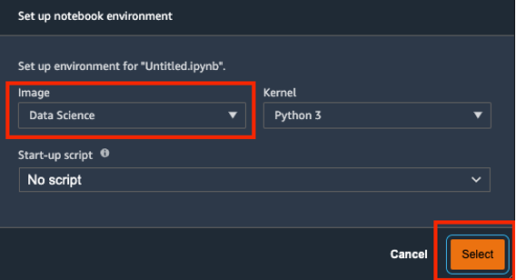
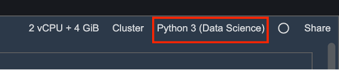
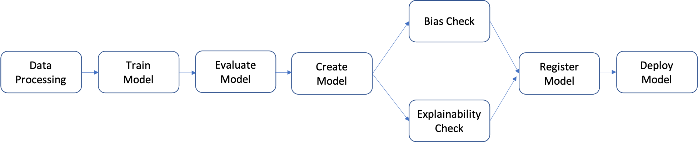

<h2>Overview</h2>

In this tutorial, learn how to create and automate end-to-end machine learning (ML) workflows using Amazon SageMaker Pipelines, Amazon SageMaker Model Registry, and Amazon SageMaker Clarify.
SageMaker Pipelines is the first purpose-built continuous integration and continuous delivery (CI/CD) service for ML. With SageMaker Pipelines, you can automate different steps of the ML workflow, including data loading, data transformation, training, tuning, evaluation, and deployment. SageMaker Model Registry allows you to track model versions, their metadata such as use case grouping, and model performance metrics baselines in a central repository where it is easy to choose the right model for deployment based on your business requirements. SageMaker Clarify provides greater visibility into your training data and models so you can identify and limit bias and explain predictions.
In this tutorial, you will implement a SageMaker pipeline to build, train, and deploy an XGBoost binary classification model that predicts the likelihood of an auto insurance claim being fraudulent. You will use a synthetically generated auto insurance claims dataset. The raw inputs are two tables of insurance data: a claims table and a customers table. The claims table has a column named fraud indicating whether a claim was fraudulent or otherwise. Your pipeline will process the raw data; create training, validation, and test datasets; and build and evaluate a binary classification model. It will then use SageMaker Clarify to test model bias and explainability, and lastly deploy the model for inference.


<h2>What you will accomplish</h2>

In this guide, you will:

<ul>
  <li>Build and run a SageMaker pipeline to automate the end-to-end ML lifecyle</li>
  <li>Generate predictions using the deployed model</li>
</ul>

In this tuorial, it is assumed that you have a Sagemaker studio domain setup. We will walk through the process of modifying the IAM role attached to the domain. 
An AWS account can have only one SageMaker Studio domain per Region

<h2>Step 1 Modifying your Sagemaker studio IAM role</h2>

<h3>Step A: Copy your SageMaker Studio user role id</h3>

In the SageMaker Studio Control Panel page, under the Users section, select your SageMaker Studio user name.


In the User Details page, under the Details pane, Execution role, highlight and copy only the text after arn:aws:iam::<your-account-id>:role/.


  
<h3>Step B: Attach AWS IAM policies</h3>
  
In this step, you attach three AWS IAM policies to your SageMaker Studio account to allow the account access to SageMaker APIs and features for automating ML workflows.
  
Enter IAM in the search bar in the SageMaker console, and then choose IAM to open the AWS IAM console.
 

  
In the IAM console, on the Identity and Access Management (IAM) pane, under Access management, choose Roles. Under the Roles pane, in the search bar, paste the Execution role text that you copied in Step A. Under Role name search results, choose the role displayed. 
  

  
In the Summary page, under the Permissions tab, Permissions polices, Add permissions, choose Attach policies.
  

  
In the Attach policy page, under Other permissions policies, enter AmazonSageMakerFullAccess, and press Enter. This policy is required to allow your SageMaker Studio account to access SageMaker APIs and features. Under Policy name, select AmazonSageMakerFullAccess, and then choose Attach policies. On the role Summary page, the newly added policy is displayed under the Permissions policies list.
  
Repeat Step B to add the AWSCloudFormationFullAccess and AmazonSageMakerPipelinesIntegrations policies.
  

  
<h3>Step C: Allow access to AWS Lambda</h3>
  
In this step, you edit the trust policy to allow access to AWS Lambda.
  
In the AWS IAM console, on the role Summary page, select the Trust relationships tab, and then choose Edit trust policy.
  

  
Copy and paste the following code into the Edit trust policy editor in the location shown in the screenshot. Make sure that the indentation of the JSON code is exactly as shown in the screenshot. Do not delete the code already in the editor, instead add the following code by inserting it at the location shown in the screenshot. Choose Update policy.
  
```
  {
                        "Effect": "Allow",
                        "Principal": {
                            "Service": "lambda.amazonaws.com"
                        },
                        "Action": "sts:AssumeRole"
 }
```
  

  
  
<h4>Congratulations! You have finished the Add permissions to your Amazon SageMaker Studio account.</h4>
  
  
  <h3>Step 2: Set up a SageMaker Studio notebook and parameterize the pipeline</h3>
  
  In this step, you launch a new SageMaker Studio notebook and configure the SageMaker variables required to interact with Amazon Simple Storage Service (Amazon S3).
  
  Enter SageMaker Studio into the AWS console search bar, and then choose SageMaker Studio. Choose US East (N. Virginia) from the Region dropdown list on the upper right corner of the console.
  
  
  
  For Launch app, select Studio to open SageMaker Studio using the studio-user profile.
  
  
  
  On the SageMaker Studio navigation bar, choose File, New, Notebook. 
  
  
  
  In the Set up notebook environment dialog box, under Image, select Data Science. The Python 3 kernel is selected automatically. Choose Select. 
  
  
  
  The kernel on the top right corner of the notebook should now display Python 3 (Data Science).
  
  
  
  To import the required libraries, copy and paste the following code in a cell in your notebook and run the cell.
  
  ```
  import pandas as pd
import json
import boto3
import pathlib
import io
import sagemaker


from sagemaker.deserializers import CSVDeserializer
from sagemaker.serializers import CSVSerializer

from sagemaker.xgboost.estimator import XGBoost
from sagemaker.sklearn.processing import SKLearnProcessor
from sagemaker.processing import (
    ProcessingInput, 
    ProcessingOutput, 
    ScriptProcessor
)
from sagemaker.inputs import TrainingInput

from sagemaker.workflow.pipeline import Pipeline
from sagemaker.workflow.steps import (
    ProcessingStep, 
    TrainingStep, 
    CreateModelStep
)
from sagemaker.workflow.check_job_config import CheckJobConfig
from sagemaker.workflow.parameters import (
    ParameterInteger, 
    ParameterFloat, 
    ParameterString, 
    ParameterBoolean
)
from sagemaker.workflow.clarify_check_step import (
    ModelBiasCheckConfig, 
    ClarifyCheckStep, 
    ModelExplainabilityCheckConfig
)
from sagemaker.workflow.step_collections import RegisterModel
from sagemaker.workflow.conditions import ConditionGreaterThanOrEqualTo
from sagemaker.workflow.properties import PropertyFile
from sagemaker.workflow.condition_step import ConditionStep
from sagemaker.workflow.functions import JsonGet

from sagemaker.workflow.lambda_step import (
    LambdaStep,
    LambdaOutput,
    LambdaOutputTypeEnum,
)
from sagemaker.lambda_helper import Lambda

from sagemaker.model_metrics import (
    MetricsSource, 
    ModelMetrics, 
    FileSource
)
from sagemaker.drift_check_baselines import DriftCheckBaselines

from sagemaker.image_uris import retrieve
  ```

  Copy and paste the following code block in a cell and run to set up SageMaker and S3 client objects using the SageMaker and AWS SDKs. These objects are needed to enable SageMaker to perform various actions such as deploying and invoking endpoints, and to interact with Amazon S3 and AWS Lambda. The code also sets up the S3 bucket locations where the raw and processed datasets and model artifacts are stored. Notice that the read and write buckets are separate. The read bucket is the public S3 bucket named sagemaker-sample-files and it contains the raw datasets. The write bucket is the default S3 bucket associated with your account named sagemaker-<your- Region>-<your-account-id> and it will be used later in this tutorial to store the processed datasets and artifacts.
  
  ```
  # Instantiate AWS services session and client objects
sess = sagemaker.Session()
write_bucket = sess.default_bucket()
write_prefix = "fraud-detect-demo"

region = sess.boto_region_name
s3_client = boto3.client("s3", region_name=region)
sm_client = boto3.client("sagemaker", region_name=region)
sm_runtime_client = boto3.client("sagemaker-runtime")

# Fetch SageMaker execution role
sagemaker_role = sagemaker.get_execution_role()


# S3 locations used for parameterizing the notebook run
read_bucket = "sagemaker-sample-files"
read_prefix = "datasets/tabular/synthetic_automobile_claims" 

# S3 location where raw data to be fetched from
raw_data_key = f"s3://{read_bucket}/{read_prefix}"

# S3 location where processed data to be uploaded
processed_data_key = f"{write_prefix}/processed"

# S3 location where train data to be uploaded
train_data_key = f"{write_prefix}/train"

# S3 location where validation data to be uploaded
validation_data_key = f"{write_prefix}/validation"

# S3 location where test data to be uploaded
test_data_key = f"{write_prefix}/test"


# Full S3 paths
claims_data_uri = f"{raw_data_key}/claims.csv"
customers_data_uri = f"{raw_data_key}/customers.csv"
output_data_uri = f"s3://{write_bucket}/{write_prefix}/"
scripts_uri = f"s3://{write_bucket}/{write_prefix}/scripts"
estimator_output_uri = f"s3://{write_bucket}/{write_prefix}/training_jobs"
processing_output_uri = f"s3://{write_bucket}/{write_prefix}/processing_jobs"
model_eval_output_uri = f"s3://{write_bucket}/{write_prefix}/model_eval"
clarify_bias_config_output_uri = f"s3://{write_bucket}/{write_prefix}/model_monitor/bias_config"
clarify_explainability_config_output_uri = f"s3://{write_bucket}/{write_prefix}/model_monitor/explainability_config"
bias_report_output_uri = f"s3://{write_bucket}/{write_prefix}/clarify_output/pipeline/bias"
explainability_report_output_uri = f"s3://{write_bucket}/{write_prefix}/clarify_output/pipeline/explainability"

# Retrieve training image
training_image = retrieve(framework="xgboost", region=region, version="1.3-1")
  ```
  
  
 Copy and paste the following code to set the names for the various SageMaker pipeline components, such as the model and the endpoint, and specify training and inference instance types and counts. These values will be used to parametrize your pipeline.

  
  ```
  # Set names of pipeline objects
pipeline_name = "FraudDetectXGBPipeline"
pipeline_model_name = "fraud-detect-xgb-pipeline"
model_package_group_name = "fraud-detect-xgb-model-group"
base_job_name_prefix = "fraud-detect"
endpoint_config_name = f"{pipeline_model_name}-endpoint-config"
endpoint_name = f"{pipeline_model_name}-endpoint"

# Set data parameters
target_col = "fraud"

# Set instance types and counts
process_instance_type = "ml.c5.xlarge"
train_instance_count = 1
train_instance_type = "ml.m4.xlarge"
predictor_instance_count = 1
predictor_instance_type = "ml.m4.xlarge"
clarify_instance_count = 1
clarify_instance_type = "ml.m4.xlarge"
  ```
  
  SageMaker Pipelines supports parameterization, which allows you to specify input parameters at runtime without changing your pipeline code. You can use the modules available under the sagemaker.workflow.parameters module, such as ParameterInteger, ParameterFloat, ParameterString, and ParameterBoolean, to specify pipeline parameters of various data types. Copy, paste, and run the following code to set up multiple input parameters, including SageMaker Clarify configurations.
  
  ```
  # Set up pipeline input parameters

# Set processing instance type
process_instance_type_param = ParameterString(
    name="ProcessingInstanceType",
    default_value=process_instance_type,
)

# Set training instance type
train_instance_type_param = ParameterString(
    name="TrainingInstanceType",
    default_value=train_instance_type,
)

# Set training instance count
train_instance_count_param = ParameterInteger(
    name="TrainingInstanceCount",
    default_value=train_instance_count
)

# Set deployment instance type
deploy_instance_type_param = ParameterString(
    name="DeployInstanceType",
    default_value=predictor_instance_type,
)

# Set deployment instance count
deploy_instance_count_param = ParameterInteger(
    name="DeployInstanceCount",
    default_value=predictor_instance_count
)

# Set Clarify check instance type
clarify_instance_type_param = ParameterString(
    name="ClarifyInstanceType",
    default_value=clarify_instance_type,
)

# Set model bias check params
skip_check_model_bias_param = ParameterBoolean(
    name="SkipModelBiasCheck", 
    default_value=False
)

register_new_baseline_model_bias_param = ParameterBoolean(
    name="RegisterNewModelBiasBaseline",
    default_value=False
)

supplied_baseline_constraints_model_bias_param = ParameterString(
    name="ModelBiasSuppliedBaselineConstraints", 
    default_value=""
)

# Set model explainability check params
skip_check_model_explainability_param = ParameterBoolean(
    name="SkipModelExplainabilityCheck", 
    default_value=False
)

register_new_baseline_model_explainability_param = ParameterBoolean(
    name="RegisterNewModelExplainabilityBaseline",
    default_value=False
)

supplied_baseline_constraints_model_explainability_param = ParameterString(
    name="ModelExplainabilitySuppliedBaselineConstraints", 
    default_value=""
)

# Set model approval param
model_approval_status_param = ParameterString(
    name="ModelApprovalStatus", default_value="Approved"
)
  ```
  
  <h3>Step 3: Build the pipeline components </h3>
  
  A pipeline is a sequence of steps that can be individually built and then put together to form an ML workflow. The following diagram shows the high-level steps of a pipeline.
  
  
  
  In this tutorial, you build a pipeline with the following steps:
  
1. Data processing step: Runs a SageMaker Processing job using the input raw data in S3 and outputs training, validation, and test splits to S3.
2. Training step: Trains an XGBoost model using SageMaker training jobs with training and validation data in S3 as inputs, and stores the trained model artifact in S3.
3. Evaluation step: Evaluates the model on the test dataset by running a SageMaker Processing job using the test data and the model artifact in S3 as inputs, and stores the output model performance evaluation report in S3.
4. Conditional step: Compares model performance on the test dataset against the threshold. Runs a SageMaker Pipelines predefined step using the model performance evaluation report in S3 as input, and stores the output list of pipeline steps that will be executed if model performance is acceptable.
5. Create model step: Runs a SageMaker Pipelines predefined step using the model artifact in S3 as an input, and stores the output SageMaker model in S3.
6. Bias check step: Checks for model bias using SageMaker Clarify with the training data and model artifact in S3 as inputs and stores the model bias report and baseline metrics in S3.
7. Model explainability step: Runs SageMaker Clarify with the training data and model artifact in S3 as inputs, and stores the model explainability report and baseline metrics in S3.
8. Register step: Runs a SageMaker Pipelines predefined step using the model, bias, and explainability baseline metrics as inputs to register the model in the SageMaker Model Registry.
9. Deploy step: Runs a SageMaker Pipelines predefined step using an AWS Lambda handler function, the model, and the endpoint configuration as inputs to deploy the model to a SageMaker Real-Time Inference endpoint.
