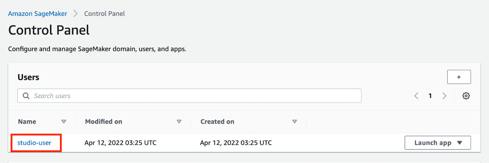
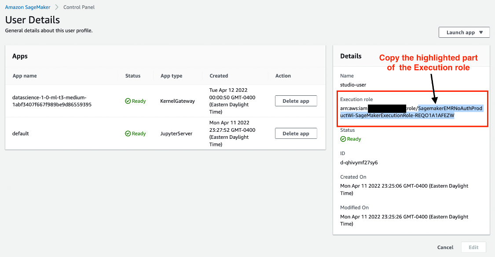
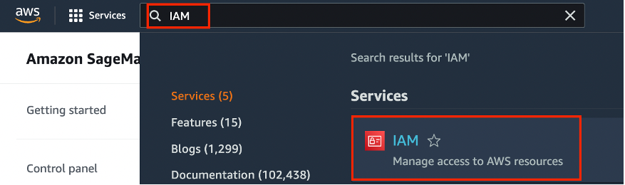
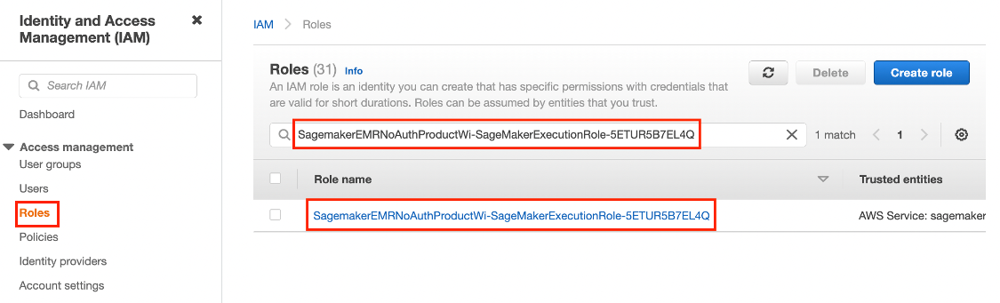
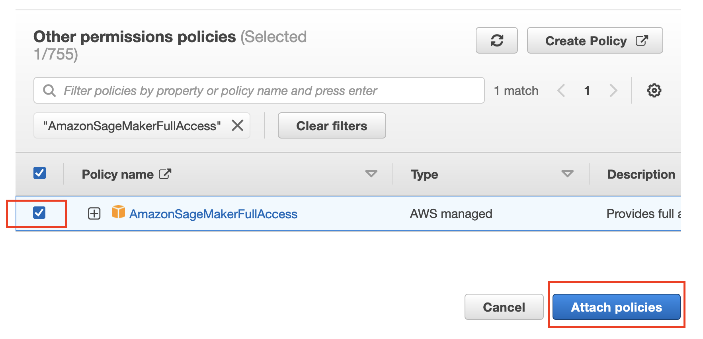
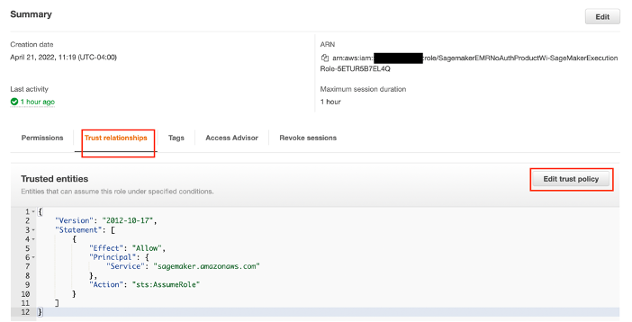
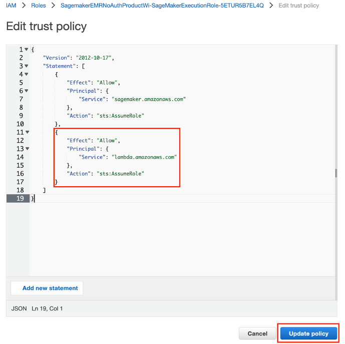

<h2>Overview</h2>

In this tutorial, learn how to create and automate end-to-end machine learning (ML) workflows using Amazon SageMaker Pipelines, Amazon SageMaker Model Registry, and Amazon SageMaker Clarify.
SageMaker Pipelines is the first purpose-built continuous integration and continuous delivery (CI/CD) service for ML. With SageMaker Pipelines, you can automate different steps of the ML workflow, including data loading, data transformation, training, tuning, evaluation, and deployment. SageMaker Model Registry allows you to track model versions, their metadata such as use case grouping, and model performance metrics baselines in a central repository where it is easy to choose the right model for deployment based on your business requirements. SageMaker Clarify provides greater visibility into your training data and models so you can identify and limit bias and explain predictions.
In this tutorial, you will implement a SageMaker pipeline to build, train, and deploy an XGBoost binary classification model that predicts the likelihood of an auto insurance claim being fraudulent. You will use a synthetically generated auto insurance claims dataset. The raw inputs are two tables of insurance data: a claims table and a customers table. The claims table has a column named fraud indicating whether a claim was fraudulent or otherwise. Your pipeline will process the raw data; create training, validation, and test datasets; and build and evaluate a binary classification model. It will then use SageMaker Clarify to test model bias and explainability, and lastly deploy the model for inference.


<h2>What you will accomplish</h2>

In this guide, you will:

<ul>
  <li>Build and run a SageMaker pipeline to automate the end-to-end ML lifecyle</li>
  <li>Generate predictions using the deployed model</li>
</ul>

In this tuorial, it is assumed that you have a Sagemaker studio domain setup. We will walk through the process of modifying the IAM role attached to the domain. 
An AWS account can have only one SageMaker Studio domain per Region

<h2> Modifying your Sagemaker studio IAM role</h2>

<h3>Step 1: Copy your SageMaker Studio user role id</h3>

In the SageMaker Studio Control Panel page, under the Users section, select your SageMaker Studio user name.



In the User Details page, under the Details pane, Execution role, highlight and copy only the text after arn:aws:iam::<your-account-id>:role/.


  
<h3>Step 2: Attach AWS IAM policies</h3>
  
In this step, you attach three AWS IAM policies to your SageMaker Studio account to allow the account access to SageMaker APIs and features for automating ML workflows.
  
Enter IAM in the search bar in the SageMaker console, and then choose IAM to open the AWS IAM console.
 

  
In the IAM console, on the Identity and Access Management (IAM) pane, under Access management, choose Roles. Under the Roles pane, in the search bar, paste the Execution role text that you copied in Step 1. Under Role name search results, choose the role displayed. 
  

  
In the Summary page, under the Permissions tab, Permissions polices, Add permissions, choose Attach policies.
  

  
In the Attach policy page, under Other permissions policies, enter AmazonSageMakerFullAccess, and press Enter. This policy is required to allow your SageMaker Studio account to access SageMaker APIs and features. Under Policy name, select AmazonSageMakerFullAccess, and then choose Attach policies. On the role Summary page, the newly added policy is displayed under the Permissions policies list.
  
Repeat Step 2 to add the AWSCloudFormationFullAccess and AmazonSageMakerPipelinesIntegrations policies.
  

  
<h3>Step 3: Allow access to AWS Lambda</h3>
  
In this step, you edit the trust policy to allow access to AWS Lambda.
  
In the AWS IAM console, on the role Summary page, select the Trust relationships tab, and then choose Edit trust policy.
  

  
Copy and paste the following code into the Edit trust policy editor in the location shown in the screenshot. Make sure that the indentation of the JSON code is exactly as shown in the screenshot. Do not delete the code already in the editor, instead add the following code by inserting it at the location shown in the screenshot. Choose Update policy.
  
```
  {
                        "Effect": "Allow",
                        "Principal": {
                            "Service": "lambda.amazonaws.com"
                        },
                        "Action": "sts:AssumeRole"
 }
```
  

  
  
<h4>Congratulations! You have finished the Add permissions to your Amazon SageMaker Studio account.</h4>
  
  
